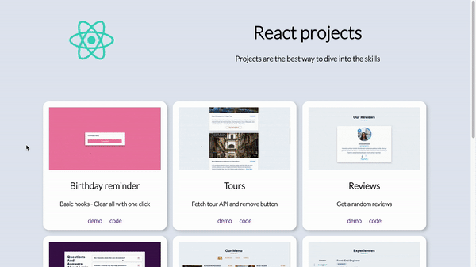

## Summary

React projects showcase page

Projects are the best way to dive into the skills.



[Live Demo](https://christy313.github.io/react15-showcase)

## File structure

```
.
└── src
    ├── components
    │   ├── Card.js
    │   └── CardList.js
    ├── container
    │   └── App.js
    ├── data
    │   └── projects.js
    ├── index.css
    └── index.js
```

## Available Scripts

In the project directory, you can run:

### `npm start`

Runs the app in the development mode.\
Open [http://localhost:3000](http://localhost:3000) to view it in your browser.
